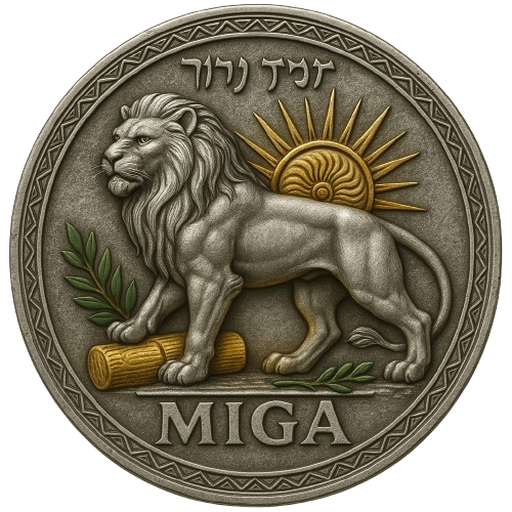

# MIGA — Make Iran Great Again

> **MIGA is not just a token; it is a symbol of hope, peace, and unity — combining ancient Persian legacy with next-generation blockchain technology.**

---

## 🌟 Project Vision

**MIGA** (Make Iran Great Again) is a symbolic token on the TON blockchain representing legacy, peace, and unity inspired by Persian heritage.  
Inspired by the ancient Cyrus Cylinder, the Lion and Sun emblem, and the olive branch, MIGA invites the global crypto community to join for a brighter future.

---

## 🔑 Key Features

- Symbolic Token — Featuring the Iranian Lion and Sun emblem  
- Community-focused — Designed to empower and unite holders  
- Airdrop-ready — Prepared for fair community distribution and events  

---

## 📝 Token Details

| Field         | Value                                                                                   |
|---------------|-----------------------------------------------------------------------------------------|
| **Name**      | MIGA                                                                                    |
| **Symbol**    | MIGA                                                                                    |
| **Decimals**  | 9                                                                                       |
| **Total Supply** | 1,400,000,000 (1.4 Billion)                                                          |
| **Standard**  | TON Jetton (Tact Custom Contract)                                                      |
| **Owner**     | UQDKJfVh5jnM0eGlOanDXWl6d8fleIZjoc7SHakWuxS6m4bL                                      |
| **Contract**  | [View on Tonviewer](#) (insert after deploy)                                           |
| **Logo**      |                                               |
| **Website**   | [https://rannta.com/miga](https://rannta.com/miga)                                     |
| **Telegram**  | [@Rannta_coin](https://t.me/Rannta_coin)                                               |
| **Twitter (X)** | [@ranntacoin](https://x.com/ranntacoin)                                               |
| **Instagram** | [ranntacoin](https://www.instagram.com/ranntacoin)                                     |

---

## 🔒 Security

MIGA is a community token emphasizing trust and transparency.  
No advanced smart guard or admin lock features; focus on symbolic value and usability.

---

## 🌍 Symbolism & Inspiration

- Cyrus Cylinder: The first human rights charter in history  
- Lion and Sun: Iconic emblem of Iran’s heritage and strength  
- Olive Branch: Universal symbol of peace and reconciliation  

---

## 🛠️ Contract & Tech

- Written in Tact for the TON blockchain  
- Open-source for full community trust  

---

## 🏛 How to Use / Wallets

- Add MIGA to TON wallets (Tonkeeper, Tonhub, MyTonWallet) using the contract address  
- After first on-chain transfer, register metadata in [Tonviewer Jetton Registry](https://tonviewer.com/jetton) and [Tonapi](https://tonapi.io/jettons)  

---

## 🤝 Community & Contact

- Telegram: [@Rannta_coin](https://t.me/Rannta_coin)  
- Twitter (X): [@ranntacoin](https://x.com/ranntacoin)  
- Instagram: [ranntacoin](https://www.instagram.com/ranntacoin)  
- Website: [https://rannta.com/miga](https://rannta.com/miga)  

---

## 📜 License

This repository is open-source under the MIT License.  
Feel free to use, fork, or contribute!

---

**MIGA — Rebirth, Legacy, Peace.**  
*Join us on the journey to make history!*
